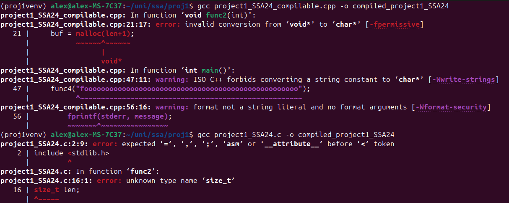
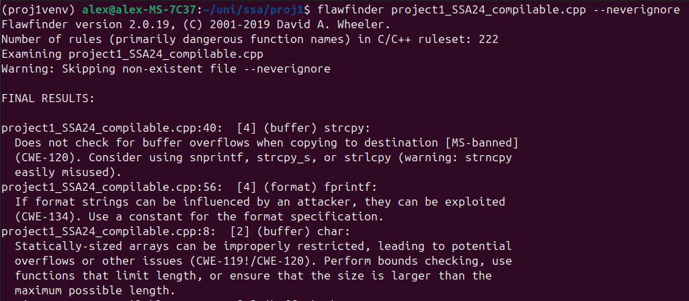

## Abstract

This is the report for the **first project** of the Security in Software Applications course directed by Daniele Friolo for the Academic Year 24/25 for the Master's Degree in **Cybersecurity** at Sapienza University of Rome. In this homework, the goal was to use the [flawfinder](https://dwheeler.com/flawfinder/) tool to **statically analyze** the provided code fragment, **reason** on all of the tool's reports, and finally output a **corrected** version where all found vulnerabilities are removed.

## Flawfinder
The flawfinder tool is a **simple, fast and lightweight** command-line utility tool for scanning C/C+ code for known security vulnerabilities. It is great as a **first check** for quickly identifying possible security problems within the code before it is sent to **more thorough** analysis tools.

Its biggest **weaknesses** lie in the fact that it is limited to static analysis only, has a high **false positive** rate, has no context awareness, and that it cannot be relied upon on its own. 

## Making the code compilable
The provided C code is **not compilable**, due to multiple syntax errors, part of which are shown below



In order to have a **more representative** output from the tool, it was decided to make the code compilable by fixing the syntax errors in the **most faithful way**.  

Specifically, to preserve the `try...catch` construct, the code was also converted into C++, as it does not exist in plain C. This is **not an issue** as the tool is able to analyze cpp files either way. 

## Utilizing the tool
The tool was then ran on the **compilable version** of the code to look for potential vulnerabilities



The following is a **rundown** of all the 13 detected warnings ordered by their **risk levels**

#### `1. project1_SSA24_compilable.cpp:40  [4] (buffer) strcpy`

```
Does not check for buffer overflows when copying to destination [MS-banned] (CWE-120). Consider using snprintf, strcpy_s, or strlcpy
```


#### `2. project1_SSA24_compilable.cpp:56  [4] (format) fprintf`

```
If format strings can be influenced by an attacker, they can be 
exploited (CWE-134). Use a constant for the format specification.
```

#### `3. project1_SSA24_compilable.cpp:8  [2] (buffer) char`

```
Statically-sized arrays can be improperly restricted, leading to
potential overflows or other issues (CWE-119!/CWE-120).
```

#### `4. project1_SSA24_compilable.cpp:27  [2] (buffer) char`

```
Statically-sized arrays can be improperly restricted, leading to 
potential overflows or other issues (CWE-119!/CWE-120). 
```

#### `5. project1_SSA24_compilable.cpp:32  [2] (buffer) char`

```
Statically-sized arrays can be improperly restricted, leading to 
potential overflows or other issues (CWE-119!/CWE-120). 
```

#### `6. project1_SSA24_compilable.cpp:34  [2] (buffer) strcat`


```
Does not check for buffer overflows when concatenating to destination
[MS-banned] (CWE-120). Risk is low because the source is a constant string.
```

#### `7. project1_SSA24_compilable.cpp:8  [1] (buffer) strlen`


```
Does not handle strings that are not \0-terminated; if given one it may
perform an over-read (it could cause a crash if unprotected) (CWE-126).
```

#### `8. project1_SSA24_compilable.cpp:9  [1] (buffer) strncpy`


```
Easily used incorrectly; doesn't always \0-terminate or check for 
invalid pointers [MS-banned] (CWE-120).
```

#### `9. project1_SSA24_compilable.cpp:9  [1] (buffer) strlen`


```
Does not handle strings that are not \0-terminated; if given one it may
perform an over-read (it could cause a crash if unprotected) (CWE-126).
```

#### `10. project1_SSA24_compilable.cpp:10  [1] (buffer) strlen`


```
Does not handle strings that are not \0-terminated; if given one it may
perform an over-read (it could cause a crash if unprotected) (CWE-126).
```

#### `11. project1_SSA24_compilable.cpp:16  [1] (buffer) read`


```
Check buffer boundaries if used in a loop including recursive loops
(CWE-120, CWE-20).
```

#### `12. project1_SSA24_compilable.cpp:22  [1] (buffer) read`


```
Check buffer boundaries if used in a loop including recursive loops (CWE-120, CWE-20).
```

#### `13. project1_SSA24_compilable.cpp:33  [1] (buffer) strncpy`


```
Easily used incorrectly; doesn't always \0-terminate or check for invalid
pointers [MS-banned] (CWE-120).
```

## Undetected vulnerabilities

## Corrected version 
The following snippet contains the corrected version of the code with **comments** attached 
```cpp 
```